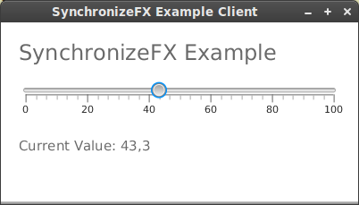

#Slider Demo
This demo project shows the usage of **SynchronizeFX**.
It consists of a small server application that has a simple domain model with a double property.

The client application shows a slider control that is synchronized between all clients.

## Step by Step

### View

At first we want to implement a small view that contains a slider control and a label that shows the current value of the slider.
Our view class extends from VBox so that it can be placed inside the SceneGraph of JavaFX.

	public class View extends VBox {
		
		private final Slider slider;	
		
		public View() {
			this.setSpacing(20);
			this.setPadding(new Insets(20));

			final Text header = TextBuilder.create().text("SynchronizeFX Example").fill(Color.DIMGRAY)
				.style("-fx-font-size:24").build();

			slider = SliderBuilder.create().min(0).max(100).showTickLabels(true).showTickMarks(true)
				.majorTickUnit(20).minorTickCount(5).snapToTicks(true).build();

			final Label valueLabel = LabelBuilder.create().textFill(Color.DIMGRAY).style("-fx-font-size:15").build();

			valueLabel.textProperty().bind(Bindings.format("Current Value: %1$.1f", slider.valueProperty()));

			this.getChildren().addAll(header, slider, valueLabel);
		}

		public DoubleProperty sliderValue(){
			return slider.valueProperty();
		}
	}

We are using the builder's of JavaFX to create our view controls. For the *valueLabel* we create a small
custom binding so that it shows the current value of the slider in a convenient way. 
The slider control is a member variable so that we can make the value property of the slider available from the outside.

The picture below shows our view component.

	
			

### Presentation Model
We like to synchronize the value of a slider control. Therefore we need a presentation model on the server side that contains a *DoubleProperty* that holds the value of the slider.

Our presentation model is a simple java class with one member variable 'sliderValue'. We follow the JavaFX Beans convention and create a getter and setter plus the property accessor named 'sliderValueProperty()'.

	public class Model {

    		private final DoubleProperty sliderValue = new SimpleDoubleProperty();

    		public DoubleProperty sliderValueProperty() {
       			return sliderValue;
    		}

    		public void setSliderValue(final double value) {
        			sliderValue.set(value);
    		}

    		public double getSliderValue() {
        			return sliderValue.get();
    		}
	}

We place this class in a package *'synchronizefx.sliderdemo.server'*.

